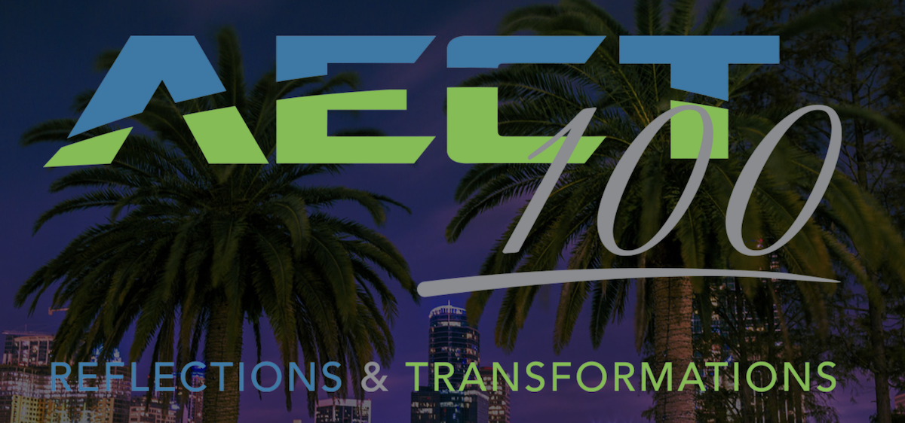
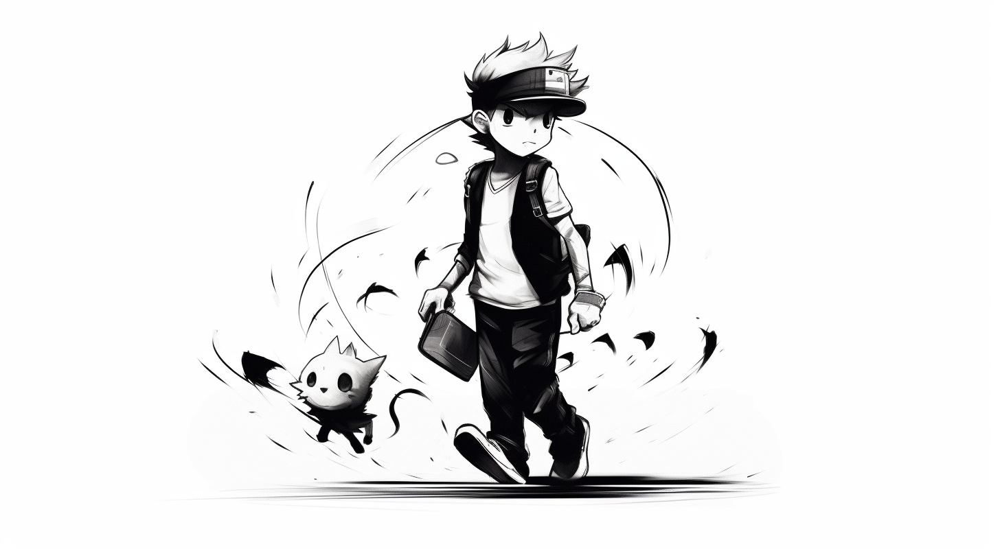
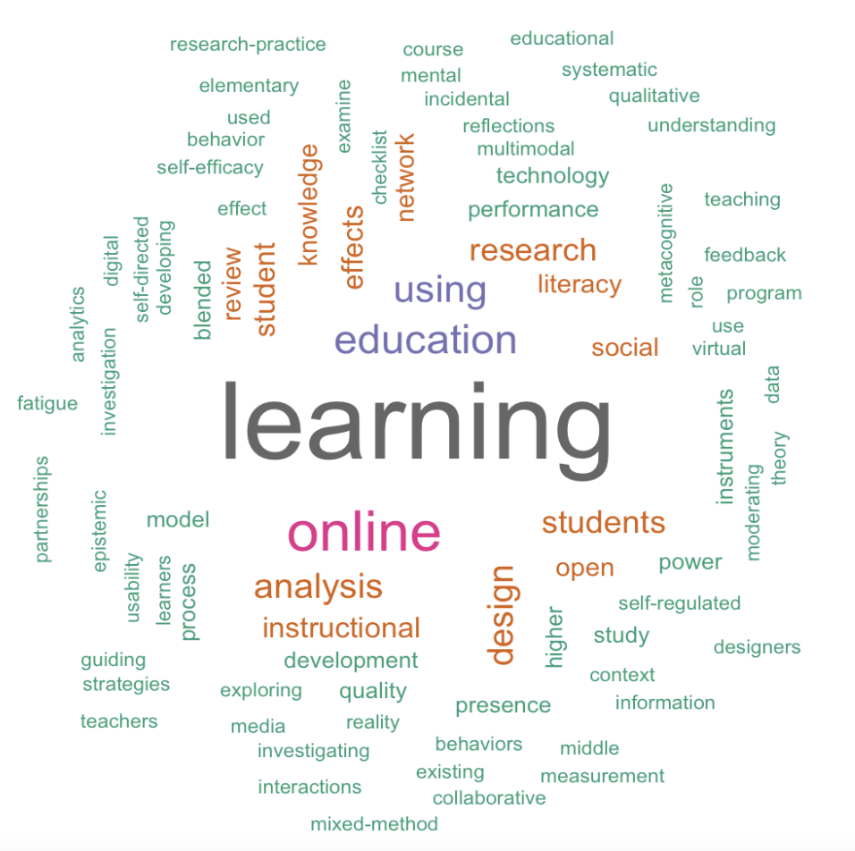
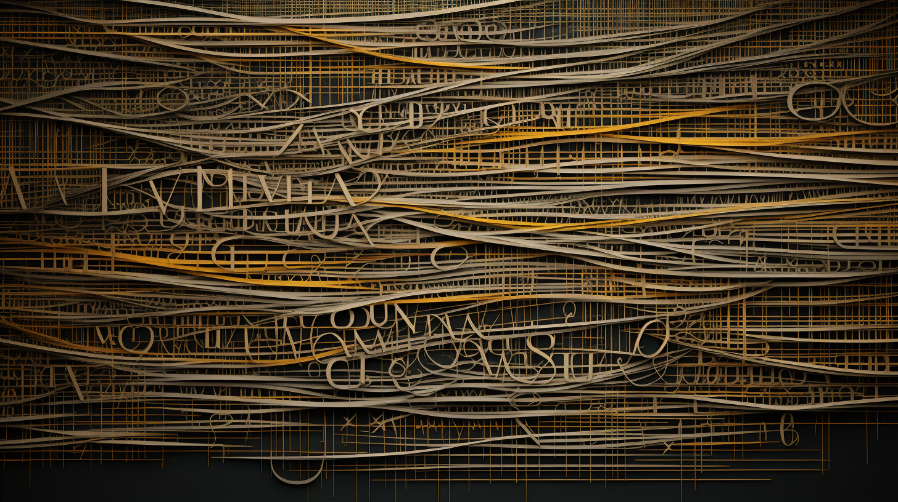
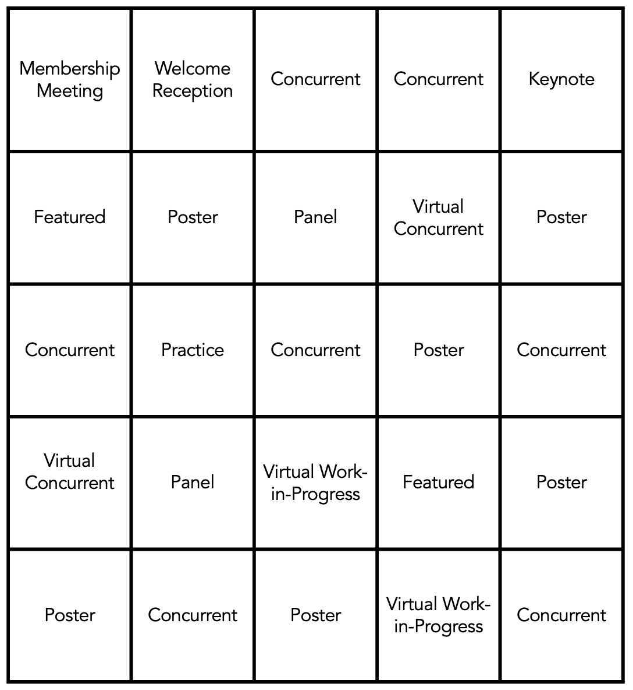

```{r setup, include=FALSE}
usethis::use_git_ignore(c("*.csv", "*.rds"))
options(htmltools.dir.version = FALSE)

library(knitr)
library(tidyverse)
library(xaringan)
library(fontawesome)
```

class: inverse, center, middle

# `r fa("fas fa-images", fill = "#fff")`

**View the slides:** 

[bretsw.com/aect23-rtd](https://bretsw.com/aect23-rtd)

---

class: inverse, center, middle

# `r fa("far fa-calendar-days", fill = "#fff")` <br><br> AECT 100: <br> Reflections and Transformations

---

# `r fa("far fa-calendar-days", fill = "#fff")` AECT 100

```{r, out.width = "480px", echo = FALSE, fig.align = "center"}

```

The 2023 convention marks 100 years as an organization. 

--

As we continue to address critical issues within our field and in our larger societies, there is value in revisiting and reflecting on:

--

- previous contributions that have shaped our current practices and perspectives

--

- fundamental theories and practices that contribute to today's research, policies, and practices

--

- whether our work includes, serves, and benefits from the diversity of learners and context

---

class: inverse, center, middle

# `r fa("fas fa-magnifying-glass-chart", fill = "#fff")` <br><br> About RTD

---

class: inverse, center, middle

# `r fa("fas fa-magnifying-glass-chart", fill = "#fff")` <br><br> Research <br> + <br> Theory

---

class: inverse, center, middle

# `r fa("fas fa-magnifying-glass-chart", fill = "#fff")` <br><br> Innovative Methods <br> + <br> Theories of Learning

---

class: inverse, center, middle

# `r fa("fas fa-magnifying-glass-chart", fill = "#fff")` <br><br>

**Research & Theory** is the division of AECT that promotes the development and advancement of theory; promotes, presents, and disseminates research and scholarship that encompasses multiple perspectives; advocates the study of social and cultural issues in the field; supports, fosters, and mentors emerging scholars.

---

class: inverse, center, middle

# `r fa("fas fa-person-walking-arrow-right", fill = "#fff")` <br><br> RTD Initiatives <br> at AECT 2023

---

# `r fa("fas fa-person-walking-arrow-right", fill = "#fff")` Early Career Symposium

```{r, out.width = "480px", echo = FALSE, fig.align = "center"}

```

--

- 2 fabulous coordinators:

--

  - Meina Zhu
  - Lucas Vasconcelos

--

- 12 participants:

--

  - 6 advanced doctoral students
  - 6 early career faculty

---

# `r fa("fas fa-person-walking-arrow-right", fill = "#fff")` Early Career Symposium

```{r, out.width = "480px", echo = FALSE, fig.align = "center"}

```

- 4 amazing mentors:

--

  - Royce Kimmons
  - Victor Law
  - Rob Moore
  - Gamze Ozogol

---

# `r fa("fas fa-person-walking-arrow-right", fill = "#fff")` Early Career Symposium

```{r, out.width = "480px", echo = FALSE, fig.align = "center"}

```

- 5 fantastic guest speakers:

--

  - Charles Reigeluth
  - David Wiley
  - Lin Lin Lipsmeyer
  - Pavlo Antonenko
  - Fengfeng Ke

---

# `r fa("fas fa-person-walking-arrow-right", fill = "#fff")` Theory Spotlight Competition

```{r, out.width = "360px", echo = FALSE, fig.align = "center"}
include_graphics("img/spotlight.png")
```

--

- 2 semi-fabulous coordinators:

--

  - Heather Leary
  - Bret Staudt Willet

--

- 3 finalists:

---

# `r fa("fas fa-person-walking-arrow-right", fill = "#fff")` Theory Spotlight Competition

```{r, out.width = "360px", echo = FALSE, fig.align = "center"}
include_graphics("img/spotlight.png")
```

**Entangled Pedagogy and Ecological Perspective for Meaningful Technology Integration**

Daeun Jung (Florida State University)

---

# `r fa("fas fa-person-walking-arrow-right", fill = "#fff")` Theory Spotlight Competition

```{r, out.width = "360px", echo = FALSE, fig.align = "center"}
include_graphics("img/spotlight.png")
```

**Inclusive Artificial Intelligence (AI) + Framework: Empowering Instructional Design for an Inclusive AI Education**

Keunjae Kim and Kyungbin Kwon (Indiana University Bloomington)

---

# `r fa("fas fa-person-walking-arrow-right", fill = "#fff")` Theory Spotlight Competition

```{r, out.width = "360px", echo = FALSE, fig.align = "center"}
include_graphics("img/spotlight.png")
```

**Learning Design and Technology Through the Lens of Intersectional Ecological Theory**

Angel Morgan (Arizona State University)

---

# `r fa("fas fa-person-walking-arrow-right", fill = "#fff")` Featured Research

```{r, out.width = "600px", echo = FALSE, fig.align = "center"}

```

--

- 1 fabulous coordinator: Spencer Greenhalgh

--

- 3 selected presentations:

---

# `r fa("fas fa-person-walking-arrow-right", fill = "#fff")` Featured Research

```{r, out.width = "600px", echo = FALSE, fig.align = "center"}

```

**Creating a Culture of Quality: The People, Policies, and Process that Promote Online Quality Assurance**

Bethany Simunich (Quality Matters)

*Monday, October 16, 9:00am*

---

# `r fa("fas fa-person-walking-arrow-right", fill = "#fff")` Featured Research

```{r, out.width = "600px", echo = FALSE, fig.align = "center"}

```

**Mental Fatigue in Online Learning Environments: Analyzing the Impact of Course Workload and Perceived Course Value**

Fethi A. Inan, Gail Alleyne-Bayne, Fatemah Marzban, Edwin Sosi, & Deniz Unal (Texas Tech University)

*Monday, October 16, 10:00am*

---

# `r fa("fas fa-person-walking-arrow-right", fill = "#fff")` Featured Research

```{r, out.width = "600px", echo = FALSE, fig.align = "center"}

```

**Shakespeare and Social Presence: The Power of Virtual Reality in Remote Education**

Erika Dale Stevens (Walters State Community College)

*Tuesday, October 17, 7:00am* (virtual)

---

class: inverse, center, middle

# `r fa("fas fa-cubes-stacked", fill = "#fff")` <br><br> RTD at AECT 2023 <br> by the Numbers

---

# `r fa("fas fa-cubes-stacked", fill = "#fff")` RTD by the Numbers

```{r, out.width = "360px", echo = FALSE, fig.align = "center"}

```

- 104 RTD proposals

--

- 313 reviews completed

---

# `r fa("fas fa-cubes-stacked", fill = "#fff")` RTD by the Numbers

```{r, out.width = "360px", echo = FALSE, fig.align = "center"}

```

- **RTD allotment:** 28 hours of content + 11 posters allotted

--

  - 63/104 acceptances (**61% acceptance rate**)

--

- **Featured Research allotment:** 3 hours of content

--

  - 3/10 acceptances (**30% acceptance rate**)

---

# `r fa("fas fa-cubes-stacked", fill = "#fff")` RTD by the Numbers

```{r, out.width = "360px", echo = FALSE, fig.align = "center"}

```

- *Onsite in Orlando:*

--

  - 11 **Posters** (all on Sunday afternoon)

--

  - 21 **Concurrent** sessions (20 minutes each = 2 papers per session)
  
---

# `r fa("fas fa-cubes-stacked", fill = "#fff")` RTD by the Numbers

```{r, out.width = "360px", echo = FALSE, fig.align = "center"}

```

- *Onsite in Orlando:*

  - 3 **Featured Research** sessions (50 minutes each)

--

  - 3 **Panel** sessions (50 minutes each)

--

  - 1 **Practice** session (50 minutes each)
  
---

# `r fa("fas fa-cubes-stacked", fill = "#fff")` RTD by the Numbers

```{r, out.width = "360px", echo = FALSE, fig.align = "center"}

```

- *Online:*

--

  - 2 **Concurrent** sessions (20 minutes each = 2 papers per session)
  
--

  - 1 **Works-in-Progress** session (20 minutes each = 2 papers per session)

---

class: inverse, center, middle

# `r fa("fas fa-arrows-to-circle", fill = "#fff")` <br><br> RTD Themes <br> at AECT 2023

---

# `r fa("fas fa-arrows-to-circle", fill = "#fff")` RTD Themes

```{r, out.width = "100%", echo = FALSE, fig.align = "center"}
include_graphics("img/rtd-wordcloud1.png")
```

---

# `r fa("fas fa-arrows-to-circle", fill = "#fff")` RTD Themes

```{r, out.width = "560px", echo = FALSE, fig.align = "center"}

```

---

# `r fa("fas fa-arrows-to-circle", fill = "#fff")` RTD Themes

```{r, out.width = "720px", echo = FALSE, fig.align = "center"}

```

- 100 years of AECT

--

- researcher-practitioner partnerships

--

- publishing theoretical articles

---

# `r fa("fas fa-arrows-to-circle", fill = "#fff")` RTD Themes

```{r, out.width = "720px", echo = FALSE, fig.align = "center"}

```

- open education

--

- self-directed learning

--

- collaborative learning

---

# `r fa("fas fa-arrows-to-circle", fill = "#fff")` RTD Themes

```{r, out.width = "720px", echo = FALSE, fig.align = "center"}

```

- computational thinking

--

- learning analytics

--

- AI & machine learning

---

class: inverse, center, middle

# `r fa("fas fa-chess-board", fill = "#fff")` <br><br> RTD Bingo <br> at AECT 2023

---

# `r fa("fas fa-chess-board", fill = "#fff")` RTD Bingo

```{r, out.width = "480px", echo = FALSE, fig.align = "center"}

```

---

class: inverse, center, middle

# `r fa("fas fa-question", fill = "#fff")` <br><br> Questions

--

**What questions can I answer for you now?**

**How can RTD support you leading up to and at the convention?**

--

<hr>

`r fa("fas fa-envelope", fill = "#fff")` [bret.staudtwillet@fsu.edu](mailto:bret.staudtwillet@fsu.edu) | `r fa("fas fa-globe", fill = "#fff")` [sites.google.com/view/aectrtd/](https://sites.google.com/view/aectrtd/)

<hr>

<div class="caption">
Images created with Midjourney. Slides made with RMarkdown.
</div>